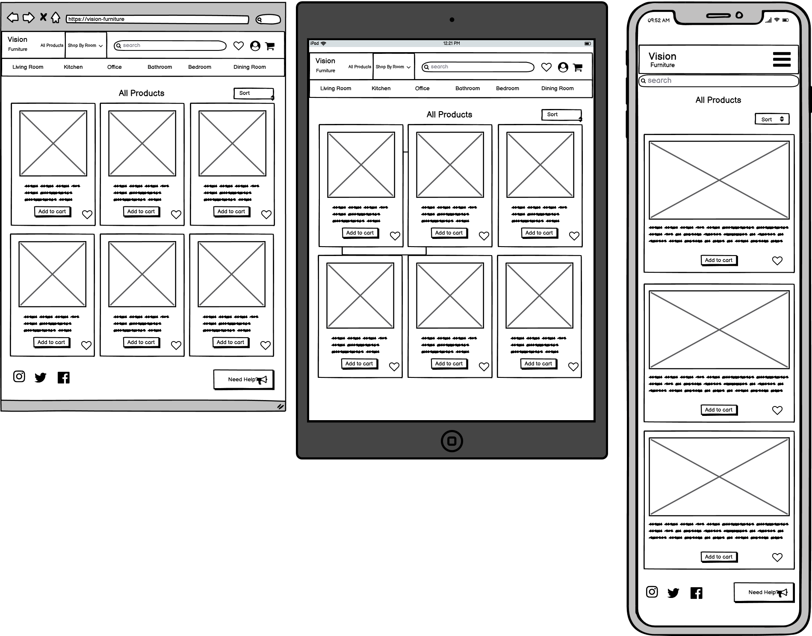

# Vision Furniture

## Contents

* [Purpose](#Purpose)
* [User Stories](#User-Stories)
* [UX](#UX)
    * [Strategy](#Strategy)
    * [Scope](#Scope)
    * [Structure](#Structure)
    * [Database Schema](#Database-Schema)
    * [Skeleton](#Skeleton)
    * [Wireframes](#Wireframes)
    * [Surface](#Surface)
* [Features](#Features)
    * [Implemented Features](#Implemented-Features)
    * [Features To Add Later](#Features-To-Add-Later)

# Purpose

Vision Furniture is an e-commerce store selling stylish vintage furniture, where people can shop for furniture from the comfort 
of their own home.
The website is entirely fictional and was created for my fourth milestone project for a software development course I am undertaking 
at the code institute.

# User Stories

### New User

As a new user of the site a want to be able to:  
1.	Browse all products – to gain some inspiration on what to buy.
2.	Sort order of products – to find the cheapest or most expensive products.
3.	Find products that go in a particular room.
4.	View details of a product – like price, delivery costs and product dimensions.
5.	Be able to view a total cost of a potential multiple purchase.
6.	Be able to search for a specific product.

### Returning User

As a returning user to the site, I would like to:  
1.	Easily register my details – to create a profile for my personal details.
2.	Be able to view my previous purchases.
3.	Edit my personal details on my profile.
4.	Be able to contact the company regarding a previous purchase.  

### Staff User 

As a member of staff, I need to be able to:
1.	Easily add, update and delete products.
2.	Easily view, update and delete customer orders.

# UX

## Strategy

The world has changed a lot in 2020/21, property sales have sharply risen, and people are spending more time at home hence a high demand 
for furniture. Online shopping has also increased significantly which is a trend which is expected to remain.  
Through the rise of Instagram and other social media sites people now have many interior design ideas at their fingertips and 
the “Vintage” theme is particularly popular. For these reasons, a new vintage style furniture store website is positioned to do very 
well at this current time.

### Research

I researched 3 e commerce furniture stores - [Johnlewis.com](https://Johnlewis.com), [MADE.com](https://made.com) and [Habitat.co.uk](https://Habitat.co.uk):

-	All had a similar navbar layout - logo on the left, search bar in the middle, profile and checkout on the right.
-	All had a mainly black and white theme which accentuated the colours of the products in the pictures.
-	Products were all laid out in a grid format.
-	To give their customers inspiration MADE had an “ideas” area, showing images of impressively designed rooms containing their products, 
if you click on the images you can see the products with the product descriptions.
-	Habitat had a “new in” section where customers can see recently added products.
-	All had a shop by room menu, containing Living room, dining room, bedroom, kitchen, office and bathroom.
-	John Lewis and Habitat had customer reviews for each product.
-	Made and John Lewis had a favourites or wish list feature for customers to save products without adding to their basket. 

## Scope 

Based upon the strategy and research,  some design features that I aim to include are:
-	Search bar for customers to search for an item that they are looking for.
-	Shop by room menu which takes the customer to products for a specific room they are looking to furnish. 
-	A shopping bag for customers to add their products and see what the total charges will come to.
-	A “new in” area for the customers to see if there are any new products on the site since they last visited.
-	Profile page for customers to save their delivery details and see their previous orders.
-	Contact us or About section for customers to query anything which is not covered on the website itself.
-	FAQ section to save on admin time replying to customer queries and to streamline the user experience.
-	On each product page the ability to sort the products by name (A-Z) or price (high to low).
-	A favourites feature for customers to save a product to their profile - if they are not ready to buy but 
wish to save the product for a future purchase.  

For now, I will not be including:
-	Ideas area. For the customers to gain inspiration from seeing the products in a room together. 
With an icon on each product that will link to the page showing the details of that product. Can be added in future 
once the minimum viable product has been built and the website is generating money.
-	Product reviews. Could possibly be added in future, more research required on how to regulate the reviews. 

### Structure

-	The site will be structured in a linear format keeping the users’ expectations as the main priority.
-	The site will have a similar layout to the websites I’ve researched, so the customers will not need to “re-learn” how 
to navigate a website and keep their user experience as streamlined as possible with minimal frustration.
-	The layout will be similar across all pages to keep a consistent and clean UX.

### Database Schema

### Skeleton

### Wireframes

Home (Click for images)

Product Pages  (Click for images)

Profile (Click for images)

Login (Click for images)

Register (Click for images)

Shopping Bag (Click for images)

Checkout (Click for images)

Checkout Success (Click for images)

Admin Add Products (Click for images)

Admin Edit Products (Click for images)

Help Centre (Click for images)

# Features

## Existing Features

### Navbar

-	All pages will contain the navbar.
-	Vision furniture logo on left side next to all products and shop by room link.
-   All products link will link to all products page.
-   Shop by room will be a full width dropdown with links to bedroom, dining room, bathroom, living room, kitchen
and office product pages.
-   Search bar in centre of navbar which will allow customers to search for keywords found in product names or descriptions.
-   Right hand logos will feature links to favorites page, my account pages and cart page.
-   Favorites link will only be visible to logged in users.
-   My account when logged in as superuser will dropdown links to product admin, help admin, my profile and logout.
-   My account when logged in as user will dropdown links to my profile and logout.
-   My account when not logged in will dropdown links to register and login.
-   In tablet view or smaller all links will be contained in a burger dropdown icon on the right side and the search 
bar will be below the navbar full width.

Navbar (Click for images)

