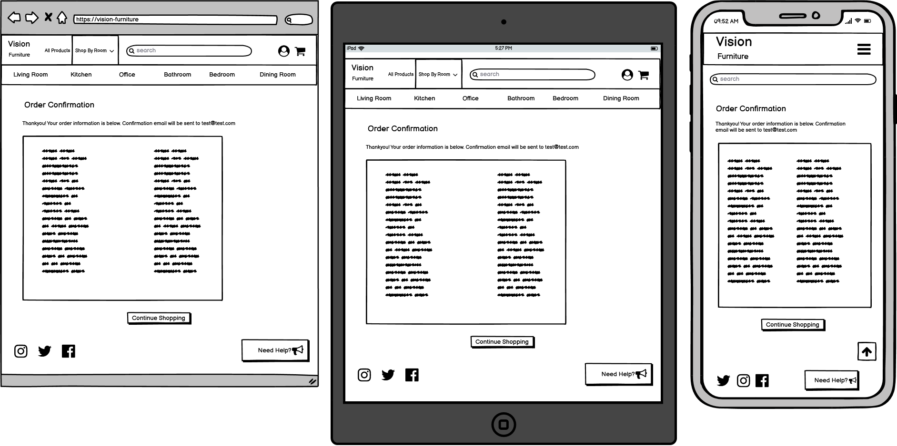

# Vision Furniture

## Contents

* [Purpose](#Purpose)
* [User Stories](#User-Stories)
* [UX](#UX)
    * [Strategy](#Strategy)
    * [Scope](#Scope)
    * [Structure](#Structure)
    * [Database Schema](#Database-Schema)
    * [Skeleton](#Skeleton)
    * [Wireframes](#Wireframes)
    * [Surface](#Surface)
* [Features](#Features)
    * [Existing Features](#Existing-Features)
    * [Features To Add Later](#Features-To-Add-Later)
* [Technologies Used](#Technologies-Used)
* [Testing](TESTING.md)
* [Deployment](#Deployment)
* [Credits](#Credits)


The live deployed website can be found [Here](https://vision-furniture.herokuapp.com/)

# Purpose

Vision Furniture is an e-commerce store selling stylish vintage furniture, where people can shop for furniture from the comfort 
of their own home.
The website is entirely fictional and was created for my fourth milestone project for a software development course I am undertaking 
at the Code Institute.

# User Stories

### New User

As a new user of the site I want to be able to:  
1.	Browse all products – to gain some inspiration on what to buy.
2.	Sort order of products – to find the cheapest or most expensive products.
3.	Find products that go in a particular room.
4.	View details of a product – like price, delivery costs and product dimensions.
5.	Be able to view a total cost of a potential multiple purchase.
6.	Be able to search for a specific product.

### Returning User

As a returning user to the site, I would like to:  
1.	Easily register my details – to create a profile for my personal details.
2.	Be able to view my previous purchases.
3.	Edit my personal details on my profile.
4.  Save products that I want to purchase in future.
5.	Be able to contact the company regarding a previous purchase.  

### Staff User 

As a member of staff, I need to be able to:
1.	Easily add, update and delete products.
2.	Easily view, update and delete customer orders.
3.  Have the ability to edit, update and delete FAQs. To be able to add if customers are repeatedly getting in contact with a particular 
question that is not already in FAQs. Or delete a FAQ if it is no longer relevant.

# UX

## Strategy

The world has changed a lot in 2020/21, property sales have sharply risen, and people are spending more time at home hence a high demand 
for furniture. Online shopping has also increased significantly which is a trend which is expected to remain.  
Through the rise of Instagram and other social media sites people now have many interior design ideas at their fingertips and 
the “Vintage” theme is particularly popular. For these reasons, a new furniture store website is positioned to do very 
well at this current time.

### Research

I researched 3 e-commerce furniture stores - [Johnlewis.com](https://Johnlewis.com), [MADE.com](https://made.com) and [Habitat.co.uk](https://Habitat.co.uk):

-	All had a similar navbar layout - logo on the left, search bar in the middle, profile and checkout on the right.
-	All had a mainly black and white theme which accentuated the colours of the products in the pictures.
-	Products were all laid out in a grid format.
-	To give their customers inspiration MADE had an “ideas” area, showing images of impressively designed rooms containing their products, 
if you click on the images you can see the products with the product descriptions.
-	Habitat had a “new in” section where customers can see recently added products.
-	All had a shop by room menu, containing living room, dining room, bedroom, kitchen, office and bathroom.
-	John Lewis and Habitat had customer reviews for each product.
-	Made and John Lewis had a favorites or wish list feature for customers to save products without adding to their basket. 

## Scope 

Based upon the strategy and research,  some design features that I aim to include are:
-	Search bar for customers to search for an item that they are looking for.
-	Shop by room menu which takes the customer to products for a specific room they are looking to furnish. 
-	A shopping bag for customers to add their products and see what the total charges will come to.
-	A “new in” area for the customers to see if there are any new products on the site since they last visited.
-	Profile page for customers to save their delivery details and see their previous orders.
-	"Contact us" or "About" section for customers to query anything which is not covered on the website itself.
-	FAQ section to save on admin time replying to customer queries and to streamline the user experience.
-	On each product page the ability to sort the products by name (A-Z) or price (high to low).
-	A favorites feature for customers to save a product to their profile - if they are not ready to buy but 
wish to save the product for a future purchase.  

For now, I will not be including:
-	Ideas area. For the customers to gain inspiration from seeing the products in a room together. 
With an icon on each product that will link to the page showing the details of that product. Can be added in future 
once the minimum viable product has been built and the website is generating money.
-	Product reviews. Could possibly be added in future, more research required on how to regulate the reviews. 

## Structure

-	The site will be structured in a linear format keeping the users’ expectations as the main priority.
-	The site will have a similar layout to the websites I’ve researched, so the customers will not need to “re-learn” how 
to navigate a website and keep their user experience as streamlined as possible with minimal frustration.
-	The layout will be similar across all pages to keep a consistent and clean UX.

### Database Schema


## Skeleton

### Wireframes

<details>
<summary>Home (Click for images)</summary>
<p align="center">


</p>
</details>

<details>
<summary>Product Pages  (Click for images)</summary>
<p align="center">


</p>
</details>

<details>
<summary>Profile (Click for images)</summary>
<p align="center">


</p>
</details>

<details>
<summary>Login (Click for images)</summary>
<p align="center">


</p>
</details>

<details>
<summary>Register (Click for images)</summary>
<p align="center">


</p>
</details>

<details>
<summary>Shopping Bag (Click for images)</summary>
<p align="center">


</p>
</details>

<details>
<summary>Checkout (Click for images)</summary>
<p align="center">


</p>
</details>

<details>
<summary>Checkout Success (Click for images)</summary>
<p align="center">


</p>
</details>

<details>
<summary>Admin Add Products (Click for images)</summary>
<p align="center">


</p>
</details>

<details>
<summary>Admin Edit Products (Click for images)</summary>
<p align="center">


</p>
</details>

<details>
<summary>Favorites (Click for images)</summary>
<p align="center">


</p>
</details>

<details>
<summary>Help Centre (Click for images)</summary>
<p align="center">


</p>
</details>


# Features

## Existing Features

### Navbar

-	All pages will contain the navbar.
-	Vision Furniture logo on left side next to all products and shop by room link.
-   All products link will link to all products page.
-   Shop by room will be a full width dropdown with links to bedroom, dining room, bathroom, living room, kitchen
and office product pages.
-   Search bar in centre of navbar which will allow customers to search for keywords found in product names or descriptions.
-   Right hand logos will feature links to favorites page, my account pages and cart page.
-   Favorites link will only be visible to logged in users.
-   My account when logged in as superuser will dropdown links to product admin, help admin, my profile and logout.
-   My account when logged in as user will dropdown links to my profile and logout.
-   My account when not logged in will dropdown links to register and login.
-   In tablet view or smaller, all links will be contained in a burger dropdown icon on the right side and the search 
bar will be below the navbar full width.


<details>
<summary>Navbar (Click for image)</summary>
<p align="center">


</p>
</details>

### Footer

-   All page will contain the same footer.
-   Social media links on left, to Facebook, Instagram and Twitter.
-   Link to help centre page on right, displaying "Need Help".

<details>
<summary>Footer (Click for image)</summary>
<p align="center">


</p>
</details>

### Home Page

- A full height and width background furniture image.
- A central title "Vision Furniture" and below "refresh your space".
- A central "view our stock" button linking to all products page.

<details>
<summary>Home (Click for image)</summary>
<p align="center">


</p>
</details>

### Product Pages

- Displaying all products or a specific products from each room, depending on where the user has linked from.
- Central title informing what products are displaying.
- Below a graphic will display underlining the title.
- Below on the left will display the number of products displaying.
- On the right will be a dropdown menu for the user to sort products by:
    - Price (low to high)
    - Price (high to low)
    - Name (A-Z)
    - Name (Z-A)
- Below will display a grid containing each product. The grid will display 3 items on each row on tablet or larger
and 1 item per row on mobile.
- Each item will display the product image, product name, product price and a button to view further details of the 
item.
- An edit and delete link will display for superusers, edit link will take the superuser to the edit product page and
delete will remove the item.
- At the bottom right a return to top button will be fixed.

<details>
<summary>Products (Click for image)</summary>
<p align="center">


</p>
</details>

### Product Detail Page

- Will display a box containing product image on the left and information on the right, and in mobile view product 
image at the top and below the product information.
- Product information will include title with the name of the product, product price, product description,
product dimensions, delivery cost, a form to increment / reduce quantity and buttons to "add to cart", "keep shopping" and
add to favorites (heart icon).
- For super users below the title links will display for superusers, edit link will take the superuser to the edit product page and
delete will remove the item.

<details>
<summary>Product Detail (Click for image)</summary>
<p align="center">


</p>
</details>

### Profile Page

- Profile page will only be accessible for logged in users.
- Will display the central heading "My Profile".
- Below a graphic will display underlining the title.
- Subheading below displaying "Your delivery Information"
- Below will be a central Django crispy form, which will be prefilled if the user has ticked the "save this 
information to my profile" checkbox on the checkout page. The form will contain:
    - Phone number
    - Street address 1
    - Street address 2
    - Town or city
    - County
    - Postcode
    - Country (dropdown)
- Central button "Update information"
- Suheading "Order history"
- A table containing the users previous orders.
- The columns for the table will be order number, date, items and order total.

<details>
<summary>Profile (Click for image)</summary>
<p align="center">


</p>
</details>

### Cart Page

- Displaying all products that have been added to cart.
- Central title "Shopping Cart"
- Below a graphic will display underlining the title.
- A table containing the users products added to cart.
- The columns for the table will be product info, price, quantity and total.
- Product info will contain the product name and image.
- Quantity will be a form to increment / reduce quantity.
- Total will be product price multiplied by quantity.
- At the bottom of the table will be delivery (calculated using delivery policy)
- A link to the delivery policy on the help centre page.
- Subtotal which will be total of all the items plus delivery cost.
- Grand total will be delivery plus subtotal.
- Below buttons to "keep shopping" and to "secure checkout"
- If there are no items in the cart, a subheading will display "Your cart is empty" and a "keep shopping" button.

<details>
<summary>Cart (Click for image)</summary>
<p align="center">


</p>
</details>

### Checkout

- Central title "Checkout"
- Below a graphic will display underlining the title.
- If the user is not registered or logged in, "Register / Login now to save your delivery information and order history"
will display and buttons to link to register and log in pages. Below will display - "In a hurry? Checkout below"
- In laptop and tablet delivery information will be a left column and order summary on the right.
- In mobile view Order summary will display above delivery information.
- Delivery information will be form with a subheading "Details" and containing name and email address and
 below a crispy form with the heading "Delivery" and the fields:
    - Phone number
    - Street address 1
    - Street address 2
    - Town or city
    - County
    - Postcode
    - Country (dropdown)
- If the user is a logged in user, at the bottom of the form will display "Save this delivery information to my profile" with a checkbox, when the user
ticks the checkbox the delivery information will be saved to their profile. 
- Below a stripe payment field will display a button to "adjust cart", which will take user back to cart page and "Complete order"
which will send payment to stripe.
- Below buttons will display "Your card will be charged (amount)"
- The order summary will display subheading of "Order Summary" and will display the information:
    - Product image
    - Product name
    - Quantity
    - Item total
    - Subtotal
    - Delivery
    - Grandtotal

<details>
<summary>Checkout (Click for image)</summary>
<p align="center">


</p>
</details>

### Checkout Success

- Central title "Thank you!"
- Below a graphic will display underlining the title.
- Display "A confirmation email will be sent to (users email address)"
- A box containing a table of: 
    - Order info: order number and date.
    - Order details: product names, quantity and price.
    - Delivering to: user name, address and phone number.
    - Billing Info: order total, delivery and grand total.
- Central button "Return to shop" which will return user to all products page.


<details>
<summary>Checkout Success(Click for image)</summary>
<p align="center">


</p>
</details>

### Admin Add / Edit Products

- Add / Edit product page will be the same layout.
- Only accessible as superuser.
- Will edit or add products that user enter into form.
- Central title "Product Administration"
- Below a graphic will display underlining the title.
- Subheading Add / Edit Product
- Central form containing:
    - Room 
    - Sku
    - Name
    - Description
    - Price
    - Delivery cost
    - Depth
    - Height
    - Width
    - Image
- Edit page will display the current image.
- Both will display a button to "Select Image".
- Edit page with display central buttons "Cancel" and "Update"
- Add page with display central buttons "Cancel" and "Add Product"

<details>
<summary>Product Admin(Click for image)</summary>
<p align="center">


</p>
</details>

### Help Centre
- Central title "Help Centre"
- Below a graphic will display underlining the title.
- Subheading "FAQ"
- Bootstrap accordion displaying questions and answers. 
- Questions and answers will be customised in the Django admin.
- Subheading "Delivery Policy".
- Table displaying delivery cost information.

<details>
<summary>Help Centre (Click for image)</summary>
<p align="center">


</p>
</details>

### Toasts

- Toast messages will appear on the top right when the user completes or attempts certain important operations.

<details>
<summary>Toasts (Click for image)</summary>
<p align="center">


</p>
</details>

## Features to Add Later

Features that will be added later due to time constraints on the project.

- Admin help centre interface. For admin to be able to edit, update and delete questions and answers directly, 
rather than through the django admin. A feature could also be added to allow the admin to edit the delivery cost
thresholds.
- Contact form on the help centre page for users to message any queries not covered in the FAQs.
- A pop up model for admin when deleting products to ensure products arent deleted accidentally.

## Technologies Used 

### Languages 

- HTML: Used for the site structure.
- CSS: Used for adding styles to the website.
- Javascript: Used to add the website interactive features.
- Python: Used to handle the backend functionality.

### Libraries and Frameworks

- Django
- Bootstrap
- Jquery

### Databases and Storage

- SQLite3: Used for development.
- PostgresSQL: Used for deployed website.
- AWS: Used for storing static files.

### Payments

- Stripe: Used to handle the payments at checkout.

### IDE and Hosting

- Gitpod: Used as IDE environment.
- Git: Used for version control.
- Github: Used for version control and repository hosting.
- Heroku: Used to host live website.

### Tools

- [Google fonts](http://Fonts.google.com) - Used to obtain the fonts.
- [Balsamiq](https://balsamiq.com/) - Used for creation of wireframes.
- [DrawSQL](https://drawsql.app/)- Used for creation of the database schema.
- [Jshint.com/](https://jshint.com/) - Used for validation of Javascript code.
- [Validator.w3.org](http://Validator.w3.org)- Used for validation of HTML code.
- [Jigsaw.w3.org/css-validator](http://Jigsaw.w3.org/css-validator) - Used for validation of CSS code.
- [Google.com/test/mobile-friendly](http://Search.google.com/test/mobile-friendly) - Used for testing the website mobile responsiveness.
- Google Chrome DevTools - Used for testing website responsiveness.
- [Randomkeygen.com](https://randomkeygen.com/) - Used for generating a random secret key.
- [Pep8online.com/](http://pep8online.com/) - Used for validating Python code.
- [favicon.io/favicon-generator/](https://favicon.io/favicon-generator/) - Used for creation and implementation of favicon.

## Testing
For the testing page [(click Here)](TESTING.md)

## Deployment

### Installation Prerequisites

To be able to run the project the following technologies will be need to be in intalled in your IDE environment.
- Python3
- Git 
- pip3

You will need to be signed up to the following services:
- [Heroku](https://signup.heroku.com/?c=70130000000NeLCAA0&gclid=Cj0KCQjwpdqDBhCSARIsAEUJ0hMbGWS3dMlZowadFExUalBu2L_UVf27xViAk9dBlCKLsRQI7V2PuScaAmCPEALw_wcB)
- [AWS](https://aws.amazon.com/)
- [Stripe](https://stripe.com/gb)

### Cloning on GitHub

1. Login to GitHub.com.
2. Open rhysseddon/Vision-Furniture-MS4-Project.
3. Click "Code" then under "Clone" copy the link with the HTTPS URL.  
4. Go to the terminal in your IDE environment. 
5. Change the working directory to where you want the clone to be saved by typing `cd` and the name of the directory.
6. Type `git clone` and paste the copied HTTPS URL.
7. After pressing enter the clone will be saved to your chosen directory.

### Local Deployment On Gitpod

1. After cloning repository on GitHub. Go to your chosen IDE environment and open the clone directory.
2. Install the libraries from the requirements.txt, in the terminal type - `pip3 install -r requirements.txt`.
3. Set your environment variables in your gitPod settings or in an env.py file.
4. If setting variables within an env file add this to the .gitignore file so your variables are not exposed 
when pushing to gitHub.
5. Your environment variables will need to be set as follows:
- os.environ["DEVELOPMENT"] = "True"
- os.environ["SECRET_KEY"] = "Your Secret key"
- os.environ["STRIPE_PUBLIC_KEY"] = "Your Stripe Public key"
- os.environ["STRIPE_SECRET_KEY"] = "Your Stripe Secret key"
- os.environ["STRIPE_WH_SECRET"] = "Your Stripe WH_Secret key"
6. Create the database from the models by typing in the terminal `python3 manage.py makemigrations`. Followed by
`python3 manage.py migrate`
7. Load the data fixtures by typing in the terminal: `python3 manage.py loaddata products`
8. Create a superuser so you can log in to the Django admin by typing in the terminal: `python3 manage.py createsuperuser`
9. The site can now be run locally by typing in the terminal `python3 manage.py runserver`

### Heroku Deployment

1. After logging in to Heroku, select "Create New App" Choose the region closest to you and select "Create app".
2. On the resources tab, to provision the database in the add on field search for and select "Heroku Postgres".
3. A pop up should appear and under "Plan name" use "Hobby Dev-Free" and select "Provision".
4. Go to your IDE and type `pip3 install dj_database_url` and `pip3 install psycopg2-binary` as these need to be 
installed to use Postgres. Also `pip install gunicorn` for the webserver.
5. To make sure Heroku installs all of the apps when deployed save the requirements by typing in the terminal
`pip3 freeze > requirements.txt`
6. Back on Heroku under settings, select "Reveal config vars" and copy the key from DATABASE_URL.
7. In the project folder on settings.py in the database setting, comment out the current database setting.
8. Replace with: 
```
DATABASES = {
    'default': dj_database_url.parse('<Enter the copied DATABASE_URL key here>')
}
```
9. Add the data to the postgres database by typing in the terminal `python3 manage.py makemigrations`. Followed by
`python3 manage.py migrate`
10. Load the data fixtures by typing in the terminal: `python3 manage.py loaddata products`
11. Create a superuser so you can log in to the Django admin by typing in the terminal: `python3 manage.py createsuperuser`
12. Return to database setting in settings.py and remove code added in step 8 and uncomment the previous database setting.
13. Create a Procfile and add `web: gunicorn vision_furniture.wsgi:application`
14. Login to Heroku through the cli `heroku login -i`
15. Temporarily disable collect static by typing `heroku config:set DISABLE_COLLECTSTATIC=1`
16. Add `vision-furniture.herokuapp.com, localhost' to ALLOWED_HOSTS in settings.py.
17. The app can now be deployed by typing in the terminal `heroku git:remote -a vision-furniture` and `git push heroku master`
18. On Heroku dashboard under "Deploy" set "Deployment method" to connect to Gitub. Under "Automatic Deplays" set 
"Enable automatic deploy" so the code is automatically deployed to Heroku and GitHub.

### Add Static Files to AWS

1. Go to AWS and find S3 under services and create a new bucket, selecting the region closest to you and 
allowing all public access.
2. Go to the new bucket and under properties tab, turn on static website hosting.
3. Under permissions tab the CORS configuration tab and enter the following:
```
[
  {
      "AllowedHeaders": [
          "Authorization"
      ],
      "AllowedMethods": [
          "GET"
      ],
      "AllowedOrigins": [
          "*"
      ],
      "ExposeHeaders": []
  }
]
```

4. Go to the bucket policy tab. And select "policy generator" so we can create a security policy for this bucket.
5. Add in the following:
- Policy type: S3 bucket policy 
- Effect: Allow
- Principal: `*`
- Action: GetObject
- Copy the ARN from the bucket policy tab. And paste it into the ARN box at the bottom.
- Click Add statement. Then generate policy.
6. Copy the policy into the bucket policy editor.
7. Add `/*` onto the end of the resource key. Click Save.
8. Go to access control list tab and set the list objects permission for everyone under the Public Access section.
9. Create a user to access the bucket by selecting IAM from the servies menu.
10. Select "Groups" and select "Create new group". Add in a new group name and click next, next again then "create new group"
11. Create a policy to access the bucket, by selecting "policies" then "create policy". Select JSON tab and import managed policy. Search for 
s3 and import "AmazonS3FullAccess".
12. Copy the bucket policy ARN from the bucket policy in s3 > permissions. Paste it into the JSON resource key on create policy twice 
giving the second paste a `/*` at the end. Select "review policy". Give the policy a name and description and create the policy.
13. Go to "groups", select the new group, select "attach policy", search for the newly created policy and attach it to the policy.
14. Go to "users", add user, create a user name, give them programmatic access and select next.
15. Add the new user to the group and select next to create user then download the .csv file.
17. Go to your IDE terminal type: `pip3 intsall boto3` and `pip3 intall django-storages` to install the packages 
to connect to django. Type: `pip3 freeze > requirements.txt` so they get installed on heroku when its deployed.
18. Add 'storages' to installed apps on the settings.py file. Add the following code to tell Django which bucket to 
communicate with:
```
if 'USE_AWS' in os.environ:
    # Bucket Config
    AWS_STORAGE_BUCKET_NAME = 'vision-furniture'
    AWS_S3_REGION_NAME = 'eu-west-2'
    AWS_ACCESS_KEY_ID = os.environ.get('AWS_ACCESS_KEY_ID')
    AWS_SECRET_ACCESS_KEY = os.environ.get('AWS_SECRET_ACCESS_KEY_ID')
    AWS_S3_CUSTOM_DOMAIN = f'{AWS_STORAGE_BUCKET_NAME}.s3.amazonaws.com'

    # Static and media files
    STATICFILES_STORAGE = 'custom_storages.StaticStorage'
    STATICFILES_LOCATION = 'static'
    DEFAULT_FILE_STORAGE = 'custom_storages.MediaStorage'
    MEDIAFILES_LOCATION = 'media'

    # Override static and media URLs in production
    STATIC_URL = f'https://{AWS_S3_CUSTOM_DOMAIN}/{STATICFILES_LOCATION}/'
    MEDIA_URL = f'https://{AWS_S3_CUSTOM_DOMAIN}/{MEDIAFILES_LOCATION}/'
```
19. On Heroku add the AWS keys from the .csv file to the config vars. Also add USE_AWS: True, so the that the setting file knows 
to use the AWS configuration when deploying to Heroku. Remove the COLLECTSTATIC variable.
20. Push all the changes to Github. Which will trigger an automatic deployment to Heroku.

## Credits

### Tutorials

- The site is based on the Boutique Ado code insitute tutorial project.
- This post on [stackoverflow.com](https://stackoverflow.com/questions/48777214/bootstrap-4-how-to-horizontally-align-elements-inside-a-drop-down) 
helped me with the design of the horizontal dropdown nav.
- This helped with my understanding of ManyToManyFields [https://www.revsys.com](https://www.revsys.com/tidbits/tips-using-djangos-manytomanyfield/)

### Images

 - Hero Image was from Sammsara Luxury Modern Home [View](https://www.pexels.com/photo/assorted-gold-plated-table-figurines-1099816/)
 - Underline title graphic from pngitem.com [View](https://www.pngitem.com/middle/JxiooJ_underline-design-and-simple-design-hand-drawn-elements/)
 - Bathroom:
    - Towel hooks, Karolina Grabowska [https://www.pexels.com/photo/wooden-hanger-with-towels-and-body-brushes-4210341/](https://www.pexels.com/photo/wooden-hanger-with-towels-and-body-brushes-4210341/)
    - Vanity Unit, Shutterstock [https://www.shutterstock.com/image-photo/large-double-vanity-master-bathroom-new-1247862721](https://www.shutterstock.com/image-photo/large-double-vanity-master-bathroom-new-1247862721)
 - Bedroom:    
    - Bedside table – Cats coming [https://www.pexels.com/photo/white-shade-table-lamp-near-bed-707579/](https://www.pexels.com/photo/white-shade-table-lamp-near-bed-707579/)
    - Scandinavian Chest of Drawers [https://www.shutterstock.com/image-illustration/blank-wall-mock-cozy-nursery-interior-1901224135](https://www.shutterstock.com/image-illustration/blank-wall-mock-cozy-nursery-interior-1901224135)
    - Grey Chest of Drawers, Shutterstock [https://www.shutterstock.com/image-photo/gold-round-mirror-above-grey-cabinet-1070451794](https://www.shutterstock.com/image-photo/gold-round-mirror-above-grey-cabinet-1070451794)
 - Kitchen:
    - Stools – Lara Santos [https://www.pexels.com/photo/shabby-stylish-design-of-coffee-shop-3741149/](https://www.pexels.com/photo/shabby-stylish-design-of-coffee-shop-3741149/)
    - Kitchen Island - Shutterstock [https://www.shutterstock.com/image-photo/chicago-il-usa-january-6-2020-1649825017](https://www.shutterstock.com/image-photo/chicago-il-usa-january-6-2020-1649825017)
 - Office:
    - Desk - Max Vakhtbovych [https://www.pexels.com/photo/interior-of-room-with-table-and-chair-6186504/](https://www.pexels.com/photo/interior-of-room-with-table-and-chair-6186504/)
    - Chair - Shutterstock [https://www.shutterstock.com/image-photo/office-chair-black-leather-isolated-110603219](https://www.shutterstock.com/image-photo/office-chair-black-leather-isolated-110603219)
    - Lamp - Skylar Kang [https://www.pexels.com/photo/computer-and-lamp-on-table-in-office-6368845/](https://www.pexels.com/photo/computer-and-lamp-on-table-in-office-6368845/) 
 - Dining Room:
    - Sideboard unit – charlotte may [https://www.pexels.com/photo/retro-fashioned-cabinet-with-elegant-lamps-in-cozy-flat-5824530/](https://www.pexels.com/photo/retro-fashioned-cabinet-with-elegant-lamps-in-cozy-flat-5824530/)
    - Dining Table Set - Shutterstock [https://www.shutterstock.com/image-illustration/diningroom-interior-provence-3d-render-265627322](https://www.shutterstock.com/image-illustration/diningroom-interior-provence-3d-render-265627322)
    - Teal Chest of drawers - Shutterstock [https://www.shutterstock.com/image-photo/real-photo-moroccan-trellis-carpet-placed-1183922602](https://www.shutterstock.com/image-photo/real-photo-moroccan-trellis-carpet-placed-1183922602)
    - Vintage Chest of drawers - Shutterstock [https://www.shutterstock.com/image-illustration/vintage-chest-drawers-classic-style-miror-1234079215](https://www.shutterstock.com/image-illustration/vintage-chest-drawers-classic-style-miror-1234079215)
 - Living Room:
    - Guilded mirror - Nadine Wuchenauer [https://www.pexels.com/photo/oval-brown-wooden-framed-hanging-mirror-1528975/](https://www.pexels.com/photo/oval-brown-wooden-framed-hanging-mirror-1528975/)
    - Wing chair - Evg culture [https://www.pexels.com/photo/brown-and-white-armchair-1148955/](https://www.pexels.com/photo/brown-and-white-armchair-1148955/)
    - Vintage Lamp - Krish Chaitu[https://www.pexels.com/photo/black-and-brown-lantern-on-table-6145852/](https://www.pexels.com/photo/black-and-brown-lantern-on-table-6145852/)
    - Chaise lounge – Charlotte May[https://www.pexels.com/photo/vintage-sofa-near-window-in-room-5824804/](https://www.pexels.com/photo/vintage-sofa-near-window-in-room-5824804/)

### Acknowledgements

- Friends and family for their honest opinions and checking responsiveness on their devices.
- Code Institute Slack Channel for valuable guidance and opinions.
- Mentor Rohit Sharma for his excellent guidance and advice.


