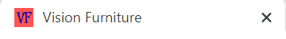

# Testing
 
## Testing Contents
* [Code Validation](#Code-Validation)
* [User Story Testing](#User-Story-Testing)
* [Manual Testing](#Manual-Testing)

#### Return to [README.md](README.md)

## Code Validation

- [Validator.w3.org](http://Validator.w3.org)- Used for validation of HTML code. Any remaining errors
are due to the Django templating language.
- [Jigsaw.w3.org/css-validator](http://Jigsaw.w3.org/css-validator) - Used for validation of CSS code.
2 errors were remaining.  This was unable to be resolved as it was an error from the Bootstrap CDN.
- [Jshint.com/](https://jshint.com/) - Used for validation of Javascript code. No remaining errors.
- [Pep8online.com/](http://pep8online.com/) - Used for validating Python code. Remaining errors of line to 
long were a personal decision to be left in the interest of readability.
- [Google.com/test/mobile-friendly](http://Search.google.com/test/mobile-friendly) and found
to be mobile friendly. 

## User Story Testing

### New User

1. "As a new user I want to be able to browse all products - to gain some inspiration on what to buy."

Upon entering the site users are prompted to "View Stock" and on the navbar they have the option to select "All Products",
this will display all of the available products for them to browse with the option of sorting by price and name.

New User 1 (Click for images)

2. "As a new user I want to be able to sort the order of products – to find the cheapest or most expensive products."  

On each of the product pages is a dropdown menu with the option to sort by price or name.

3. "As a new user I want to be able to find products that go in a particular room."  

The main navbar has the option to select a dropdown, containing the options to select to view products in each room.

4. "As a new user I want to be able to view details of a product – like price, delivery costs and product dimensions."  

If a user selects "View Item" on any of the products, further details of the product are available including delivery 
costs and product dimensions. The delivery costs policy is also available from the help centre and can also be accessed via the cart.

New User 4 (Click for images)

5. "As a new user I want to be able to view a total cost of a potential multiple purchase."  

After adding their products to the cart, the total cost for the purchase is available.

New User 5 (Click for images)

6. "As a new user I want to be able to search for a specific product."  

In the navbar users have the ability to search for keywords found in the product names or descriptions.

### Returning User

1. "As a returning user to the site, I would like to easily register my details – to create a profile for my personal details."  

Upon checking out and when selecting "my account" users are prompted with the option to register an account. From 
there they will be directed to the register page whereby they can register there details to create a profile.

Returning User 1 (Click for images)

2. "As a returning user to the site, I would like to be able to view my previous purchases."  

On the profile page users are able to view their previous purchases, users will also be sent confirmation emails
upon purchasing, so can view them in there emails too.

3. "As a returning user to the site, I would like to edit my personal details on my profile."  

On the profile page returning users have the ability to update their information and also when checking out
they have the ability to save the infromation to their profile by ticking the checkbox.

Returning User 3 (Click for images)

4. "As a returning user to the site, I would like to save products that I want to purchase in future."  

When viewing the further details of the products logged in users have the ability to add products to their favorites
page by selecting the heart icon.  

5. "As a returning user to the site, I would like to be able to contact the company regarding a previous purchase."  

Contact information is available in the FAQs on the help centre page, a contact form is planned as a future feature.  

### Staff User

1. "As a member of staff, I need to be able to easily add, update and delete products."
- Products can be added by superusers via "my account" > "product administration". There they will be directed to a
page where they can fill in a form to add a new product.  

Staff User 1 (Click for images)

- Users can update and delete products via a link on each product. When selecting "Edit" users are directed to 
a page where they can fill in a form to edit a product.  

Staff User 2 (Click for images)

2. "As a member of staff, I need to be able to easily view, update and delete customer orders."  

When logging in to the Django admin, and selecting "orders" staff users have the ability to view, update and delete all customer orders.  

Staff User 2 (Click for images)

3. "As a member of staff, I need to be able to have the ability to edit, update and delete FAQs. To be able to add if customers are repeatedly getting in contact with a particular 
question that is not already in FAQs. Or delete a FAQ if it is no longer relevant.  

When logging in to the Django admin, and selecting "Help" staff users have the ability to view, update and delete the FAQs.

## Manual Testing

### Favicon

- The website favicon should display in the browser tab.

### Navbar

1. Vision Furniture logo must link to homepage.
2. All Products must link to a page displaying all products.
3. "Shop by room" must drop a full width horizontal menu containing every room.
4. Search Bar must be visible central in the navbar on desktop and full width below the navbar in small screen sizes,
see search bar test case for functionality test.
5. Favorites link must only be visible for logged in users and should link to the favorites page.
6. My account must be a visible link and when selected for: 
- Unregistered users must display links to "Register" and "Login". 
- Users the dropdown must display links to "My Profile" and "Logout". 
- Super users must display links to "Product Administration", "My Profile" and "Logout".
- All links must direct to the desired location. (See Registering and Authentication for functionality)
7. Cart link must be visible and must display the cart total below. To test this add, delete and update a number
of items in the cart to test if the amount updates correctly.
8. Using devtools switch to tablet and mobile views, all links must now be contained inside a burger icon menu.
9. Repeat steps 3 to 7 to test in these views.
10. Navbar should be fixed to the top of the page in all screen sizes and on all pages.

### Search Bar

1. Must contain the placeholder "What is your Vision?".
2. Search for a keyword found in a product name. Correct results must display on product page.
3. Search for a keyword found in a product product description. Correct results must display on product page.
4. Search for a keyword not found in a product name or description, products page must display with no results.
5. When searching with the input empty, an error message must display. "Please enter search critera".

### Footer

1. Footer must display the same on all screen sizes.
2. Social media links must display on the left, and should link to the correct social media sites.
3. "Need Help" button should display on the right and should link to the help centre.

### All Auth pages

All of the all auth pages must display an underline graphic below the title.

#### Registering

1. Register page display the title "Sign up".
2. Must display "Already have an account? Then please sign in", "Sign in must be a link and must direct to login page".
3. Must display allauth form containing, Email, Email(again), Username, Password and Password (again).
4. Must display an error message if the user attempts to use an already registered username.
5. Must display an error message if the emails entered do not match. 
6. Must display an error message if the passwords entered do not match.
7. An error message must display if any of the fields are not completed to the correct format.
8. When the form is successfully completed a message must display on the page "Verify your email address", an 
information message must appear "Confirmation email sent to <emailaddress>".
9. A check should be done to confirm the email was sent to the desired email address. 

#### Authentication

1. Login display the title "Sign In".
2. Must display "If you have not created an account yet, then please sign up first". "Sign up" must be a link 
directing to the register page.
3. Must display an all auth sign in form containing "Login" and "Password".
4. Must display an error message if the user name is not in the database and/or if the password is incorrect.
5. An error message must display if any of the fields are not completed to the correct format.
6. A checkbox must display "Remember Me", and when checked the users information should be saved, so login is not 
required.
7. Home and Sign in buttons must display and direct to the desired locations.
8. Forgot password link must display and when selected should direct to the all auth pages to reset the password.
9. A check must be carried out the test if the reset password email was sent.
10. On the email a link should be selected to return to the site where the user must be able to enter a new password.
11. The user should then be prompted with a message on the page "Password reset". The confirmation email
confirming the password reset must also be checked.
12. Check that the new password works by logging in again. Success message must appear when successfully signed in.
13. Logout Page must display the title "Sign Out" and when selecting the button "Sign Out" all users must be signed out,
users should be directed back to the home page and a success message must appear "You have signed out". 

### Home Page

1. The page must display a background image.
2. A central title must display "Vision Furniture" and below "Refresh Your Space"
3. A button must display "View Our Stock" and must direct to the products page where all of the products must display.

### Profile Page

1. Must display the title "My Profile".
2. Underline graphic must display under title.
3. Subtitle must display "Your Delivery Information".
4. Must display a prefilled form containing phone number, street address 1, street address 2, town or city, county, postcode.
5. Must display a button "Update Information"
6. A test should be carried out by filling in the form and selecting "Update Information" then checking if the information 
was updated in the database by entering another page then entering my profile again in my account.
7. Below the form must display a subheading "Order History". 
8. A table must display with the columns order number, date, items and order total.
9. An order should be placed on the website to test if it appears in the order history with the correct values
in the table.

### Products Page

1. Should contain the title "Products"
2. Underline graphic must display under title.
3. On the left the number of product displaying should be shown.
4. On the right a drop down box must display with the placeholder "Sort By".
5. The dropdown should contain the options to sort by:
- Price (low to high)
- Price (high to low)
- Name (A to Z)
- Name (Z to A)
6. Each of these sorting options should be tested and the desired sort results must be correct.
7. When accessed through the "All Products" link in the navbar and "View Stock" on the homepage all products in the 
database should be displayed.
8. When accessed through any of the "Shop By Room" links on the navbar only the products from that particular room
must display and a sub-heading of that room should display.
9. Below must display a grid containing each product. The grid will display 3 items on each row on tablet or larger 
and 1 item per row on mobile.  
10. Each item must display the product image, product name, product price and a button "View Item". When the button is
selected users must be directed to that product details page.
11. For users logged in as superusers an edit and delete link must display. The edit link must redirect to the
edit product page and the delete link must remove the item. This can be tested by then searching for the deleted item.
12. A fixed up arrow button must display in the bottom right corner and must direct users to the top of the page.

### Product Details

1. The product details must display inside a box. 
2. In small screen sizes the product image must display above the product details, in medium screen sizes and larger
the image must display on the left with the product details on the right.  
3. The product details must display a title with the name of the product.
4. For logged in users, next to the title must display a black button with a heart icon. To test this:
 - Select the button, a toast message must appear "Added product to favorites".
 - Go to the favorites page and check the product displays on the page.
 - Select "View Item" and when back on the product detail page select the heart button again, a toast message must 
 then appear "Removed product from favorites".
 - Return to the favorites page to check if the product has been removed.
 - Repeat these step on another product.
5. For superusers, below the title must display the links Edit|Delete. The edit link must redirect to the
edit product page and the delete link must remove the item. This can be tested by then searching for the deleted item.
6. Below these links the details of price, product discription, dimensions, delivery cost must display.
7. A box labelled quanitity must display, followed by the buttons "Keep Shopping and Add to Cart".
8. Test the quanity box plus and minus button functionality. And the add to cart button functionality which should trigger
a toast message "Success, Added <item> to your cart". The toast should also include all of the items in the cart
displaying their image, name and quantity . Add different quantities of items and check the cart page and the toast 
to see if the correct number of items was added. 
9. The "Keep Shopping" button should direct to the all products page.

### Cart

1. Should contain the title "Shopping Cart"
2. Underline graphic must display under title.
3. On meduim screens sizes and above must display a table containing product info, price, quantity and total.
4. Check functionality of quantity box, increase and decrease the quantity and select update to test if the price
and the below totals update correctly.  
5. Selecting remove should remove the item from the page and the totals should update accordingly along with a toast success message. 
Remove all items from the cart to test if the cart displays blank with a subheading of "Your cart is empty"
6. On small screensize products must display full width for each product.
7. Test functionality of "See our delivery policy button", which must direct to the help centre.
8. The "Keep Shopping" button should direct to the all products page.
9. The "Secure Checkout" button should direct to the checkout page and the products in the cart should display on this 
page also. 
10. With items in the cart logout and go to the cart page, it must display blank with a subheading of "Your cart is empty".
11. Log back in again and check if the items from the previous login are still in the cart.

### Checkout

1. The checkout page should only be accessible with items in the cart.
2. Must contain the title "Checkout"
3. Underline graphic must display under title.
4. Logged out users should be prompted to "login / register now to save your delivery information and order history",
chech the functionality of the register/login buttons. Below them should display "In a hurry? Checkout below".
5. On medium and lager screensizes delivery information must display on the left with order summary on the right.
6. On small screen sizes order delivery information and order summary must display full width with order summary
displaying above.
7. Order summary must display the subheading "Order summary" and must contain product image, name, quantity, total
, subtotal and grand total.
8. Delivery information must contain the subheadings "Details", "Delivery" and payment".
9. The delivery information form should full name, email address, phone number, street address 1, street address 2, town or city, county, postcode and
country (dropdown) and should be prefilled for logged in users.
10. Below the form for logged in users "Save this information to my profile" with a checkbox must display. Test the functionality of this by 
changing the information and once the order is placed check it has been saved in "my profile".
11. Using the stripe test card numbers attempt to complete a payment, when selecting "Complete order" it should
direct to the checkout success page with a toast message to confirm.
12. Login to the django admin to confirm the order was created.
13. Check the user was sent an email confirmation of the order.
14. "Adjust cart" button should direct to the shopping cart page.
15. Below the buttons should display "Your card will be charged <amount>". Check that the amount matches the grand total.

#### Checkout Success

1. Must contain the title "Thankyou"
2. Underline graphic must display under title.
3. Subheading "Order summary"
4. Below "A confirmation email will be sent to <user email>"
5. A box containing the order details below, check this information matches the placed order.
6. Return to shop button should return to all products page.

###  Edit Product

1. Must only be accessible for loged in superusers.
2. Must contain the title "Product Administration"
3. Underline graphic must display under title.
4. Must display the subheading "Edit Product"
5. Must contain a prefilled form with the information, room (dropdown), sku, name, description, price, delivery cost,
depth, height, width, image url and current image.
6. "Cancel" should direct to products page. 
7. Check functionality by making changes to all fields and selecting "update product". This should then direct to the updated 
product detail page. Check on products pages that the information has updated also.

###  Add Product

1. Must only be accessible for loged in superusers.
2. Must contain the title "Product Administration"
3. Underline graphic must display under title.
4. Must display the subheading "Add Product"
5. Must contain an empty form with the information, room (dropdown), sku, name, description, price, delivery cost,
depth, height, width, image url and current image.
6. "Cancel" should direct to products page. 
7. Check functionality by adding information to all fields and selecting "Add product". This should then direct to the new 
product detail page. Check on products pages that the new product displays.

### Favorites

1. Must only be accessible by logged in users.
2. Must contain the title "Favorites"
3. Underline graphic must display under title.
4. When no favorites have been added must display "You have no favorites" and a button "view products" that must direct to
the products page"
5. When products have been added they must display a grid containing each product. The grid will display 3 items on each row on tablet or larger 
and 1 item per row on mobile.  
6. Each item must display the product image, product name, product price and a button "View Item". When the button is
selected users must be directed to that product details page.

### Help centre

1. Must contain the title "Help Centre"
2. Underline graphic must display under title.
3. Subheading must be FAQ.
4. Below should display an accordion with the questions in the accordion heads and the answers in the accordion bodies.
5. Go to "help" in the django admin and select "add help", add a new question and answer then return to the help centre 
to check if the new information is displaying.
6. Go to "help" in the django admin and select the question that was created in the previous step, edit the information 
then return to the help centre to check if the updated information is displaying.
7. Return to "help" in the django admin and select the question that was edited in the previous step, delete the 
FAQ, then return to the help centre to check if the FAQ was deleted.
8. Below the accordion a table displaying the delivery policy must display. 

### Devtools

The website was extensively tested for responsiveness in Google Chrome Devtools on the following devices:

- Moto G4
- Galaxy S5
- Pixel 2
- Pixel 2 XL
- Phone 5/SE
- Phone 6/7/8
- Phone 6/7/8 Plus
- Phone X
- Ipad
- Ipad Pro
- Surface Duo
- Galaxy Fold

### Browsers

The website was tested for responsiveness on the following browsers:

- Google Chrome
- Safari
- Microsoft Edge
- Firefox

### Friends and family

I requested some feedback from friends and family on the how the website displays on their devices. It was thereby sucessfully tested on iPhone 7, iPhone 8,
 iPhone X, iPad, two makes of laptop computer and one desktop this covered Chrome, Microsoft Edge and Safari. 

### Return to [README.md](README.md)

