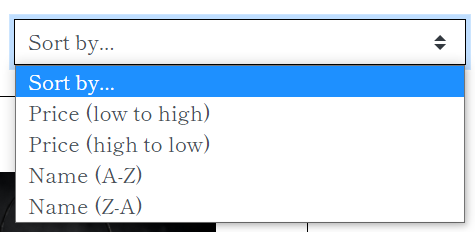
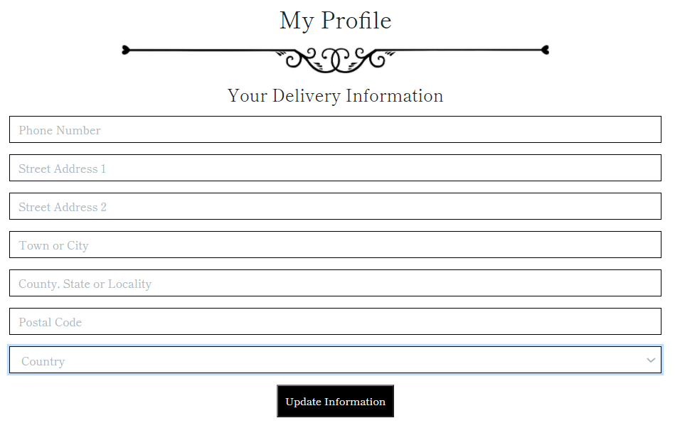

# Testing
 
## Testing Contents
* [Code Validation](#Code-Validation)
* [User Sory Testing](#User-Story-Testing)

#### Return to [README.md](README.md)

## Code Validation

- [Validator.w3.org](http://Validator.w3.org)- Used for validation of HTML code. Any remaining errors
are due to the Django templating language.
- [Jigsaw.w3.org/css-validator](http://Jigsaw.w3.org/css-validator) - Used for validation of CSS code.
2 errors were remaining.  This was unable to be resolved as it was an error from the Bootstrap CDN.
- [Jshint.com/](https://jshint.com/) - Used for validation of Javascript code. No remaining errors.
- [Pep8online.com/](http://pep8online.com/) - Used for validating Python code. Remaining errors of line to 
long were a personal decision to be left in the interest of readability.
- [Google.com/test/mobile-friendly](http://Search.google.com/test/mobile-friendly) and found
to be mobile friendly. 

## User Story Testing

### New User

1. "As a new user I want to be able to browse all products - to gain some inspiration on what to buy."

Upon entering the site users are prompted to "View Stock" and on the navbar they have the option to select "All Products",
this will display all of the available products for them to browse with the option of sorting by price and name.

2. "As a new user I want to be able to sort the order of products – to find the cheapest or most expensive products."
On each of the product pages is a dropdown menu with the option to sort by price or name.

3. "As a new user I want to be able to find products that go in a particular room."
The main navbar has the option to select a dropdown, containing the options to select to view products in each room.

4. "As a new user I want to be able to view details of a product – like price, delivery costs and product dimensions."
If a user selects "View Item" on any of the products, further details of the product are available including delivery 
costs and product dimensions. The delivery costs policy is also available from the help centre and can also be accessed via the cart.

New User 4 (Click for images)

5. "As a new user I want to be able to view a total cost of a potential multiple purchase."
After adding their products to the cart, the total cost for the purchase is available.

6. "As a new user I want to be able to search for a specific product."
In the navbar users have the ability to search for keywords found in the product names or descriptions.

### Returning User

1. "As a returning user to the site, I would like to easily register my details – to create a profile for my personal details."
Upon checking out and when selecting "my account" users are prompted with the option to register an account. From 
there they will be directed to the register page whereby they can register there details to create a profile.

2. "As a returning user to the site, I would like to be able to view my previous purchases."
On the profile page users are able to view their previous purchases, users will also be sent confirmation emails
upon purchasing, so can view them in there emails too.

3. "As a returning user to the site, I would like to edit my personal details on my profile."
On the profile page returning users have the ability to update their information and also when checking out
they have the ability to save the infromation to their profile by ticking the checkbox.

New User 4 (Click for images)

4. "As a returning user to the site, I would like to save products that I want to purchase in future."
When viewing the further details of the products logged in users have the ability to add products to their favorites
page by selecting the heart icon.

5. "As a returning user to the site, I would like to be able to contact the company regarding a previous purchase."
Contact information is available in the FAQs on the help centre page, a contact form is planned as a future feature. 

### Staff User

1. "As a member of staff, I need to be able to easily add, update and delete products."
- Products can be added by superusers via "my account" > "product administration". There they will be directed to a
page where they can fill in a form to add a new product.

- Users can update and delete products via a link on each product. When selecting "Edit" users are directed to 
a page where they can fill in a form to edit a product.

2. "As a member of staff, I need to be able to easily view, update and delete customer orders."
When logging in to the Django admin, and selecting "orders" staff users have the ability to view, update and delete all customer orders.

3. "As a member of staff, I need to be able to have the ability to edit, update and delete FAQs. To be able to add if customers are repeatedly getting in contact with a particular 
question that is not already in FAQs. Or delete a FAQ if it is no longer relevant.
When logging in to the Django admin, and selecting "Help" staff users have the ability to view, update and delete the FAQs.
